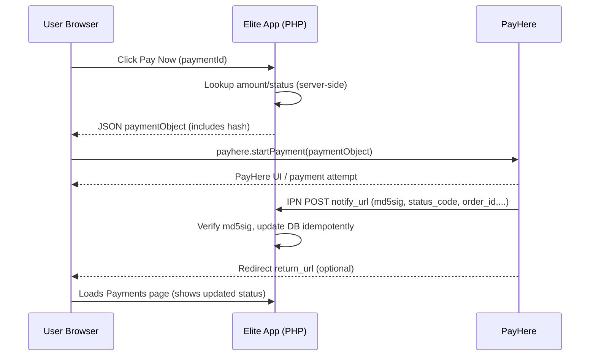

# PayHere Payment Integration Guide (Widget / Checkout)

**Project:** Elite Cricket Academy (PHP MVC on XAMPP)

This guide explains how to add **PayHere Checkout (Widget)** payments to this codebase in a safe, maintainable way. It is written for the structure used in this repository:

- `public/index.php` loads `app/bootloader.php`
- Routing: `app/libraries/Core.php` (URL → Controller → Method)
- Controllers: `app/controllers/*.php`
- Models: `app/models/*.php`
- Views: `app/views/**/*.php`
- Helpers: `app/helpers/*.php`
- Config: `app/config/config.php` (defines `URLROOT`, DB, etc.)

If you follow this guide, you will implement payments in a way that:

- **Never exposes the Merchant Secret** to the browser
- Uses PayHere’s **IPN (`notify_url`)** as the source of truth for payment completion
- Handles **retries / duplicate IPNs** safely (idempotent updates)

---

## 1) PayHere terminology (what PayHere expects)

When using the PayHere Widget/Checkout:

- The browser calls `payhere.startPayment(paymentObject)`
- PayHere shows the payment UI (card/bank/… depending on merchant settings)
- PayHere calls your URLs:
  - **`notify_url`**: server-to-server POST (IPN). This is the authoritative result.
  - **`return_url`**: user redirect after payment attempt
  - **`cancel_url`**: user redirect if they cancel

### 1.1 Why you must use `notify_url`

The customer redirect (`return_url`) is **not reliable**:

- user can close the tab early
- redirects can be blocked
- redirect does not guarantee settlement

So:

- `return_url`/`cancel_url` = UX only
- **`notify_url` = update database**

---

## 2) Recommended architecture for this codebase

### 2.1 Minimal components

Implement these pieces:

1. **Config**: store merchant id/secret and sandbox flag.
2. **Helper**: compute checkout hash and verify IPN signature (`md5sig`).
3. **Controller** (PayHere callbacks + init endpoints):
   - `init_*` endpoints to return the payment object to the browser (JSON)
   - `notify` endpoint (IPN)
   - `return`/`cancel` routes
4. **Model updates** to:
   - fetch a pending payment record
   - set a payment record `completed/failed/refunded`
5. **UI**: “Pay Now” button calls init endpoint then starts widget.

### 2.2 Suggested request flow (sequence)



---

## 3) Configuration checklist

### 3.1 Credentials

From PayHere you will have:

- `merchant_id`
- `merchant_secret`

Use **Sandbox** first.

### 3.2 Where to store secrets

In this repo, config is typically defined in `app/config/config.php`. For production, consider using environment variables instead, but if you stay with config constants:

- Do not commit real secrets to git.
- Use different secrets for sandbox vs live.

### 3.3 Sandbox vs live library

PayHere provides a JS library, with different URLs for sandbox/live.

- Sandbox JS library (for testing)
- Live JS library (for production)

Your view can switch based on a config flag.

---

## 4) Database strategy (what to store)

Your DB already contains payment-related tables, for example:

- `subscriptionpayment` (monthly membership fees)
- `productorder` (shop orders)
- `sessionpayment` (trainer session payments)

### 4.1 Key principle: one internal record → one PayHere `order_id`

You should generate `order_id` as a stable mapping to your own primary key.

Examples:

- Subscription payment `PaymentID=123` → `order_id = SUBPAY-123`
- Shop order `OrderID=77` → `order_id = ORDER-77`
- Session enrollment/payment `PaymentID=555` → `order_id = SESSPAY-555`

This allows IPN to map PayHere events back to your DB safely.

### 4.2 What fields are useful to store

Minimum:

- internal primary key
- `status` (`pending/completed/failed/refunded`)
- `amount` and `currency`
- `PaymentMethod` (set to `online` when PayHere succeeds)
- `PaymentDate` / `PaidAt`

Optional but recommended:

- PayHere `payment_id` (or transaction reference)
- last IPN payload (JSON) for debugging

---

## 5) Hashing and signature verification (security-critical)

### 5.1 Checkout hash (generated by your server)

PayHere requires a `hash` in the payment object.

Conceptually, the hash is derived from:

- merchant id
- order id
- amount (formatted with 2 decimals)
- currency
- merchant secret

**Rules:**

- Generate it on the server only.
- Always use server-side amount and currency from your DB/config.

### 5.2 IPN signature verification (`md5sig`)

The IPN includes `md5sig`. Your server must verify it using the merchant secret.

**Rules:**

- If signature fails → reject/ignore the IPN (do not update DB)
- Signature verification must happen before trusting `status_code`, `order_id`, `amount`, etc.

### 5.3 Idempotency (avoid double updates)

PayHere may send IPN multiple times.

Implement DB updates like:

- `UPDATE ... WHERE Status='pending'`

So repeated IPNs do not create double side effects.

---

## 6) Required endpoints (recommended naming)

### 6.1 Init endpoint (AJAX)

Purpose: Return a payment object for `payhere.startPayment()`.

Inputs:

- internal payment identifier (e.g., `payment_id`)

Server actions:

- require auth (Player logged in)
- fetch record and ensure it belongs to logged-in user
- ensure status is `pending`
- compute amount (including late fees if applicable)
- compute checkout hash
- return JSON:
  - sandbox flag
  - `merchant_id`
  - `return_url`, `cancel_url`, `notify_url`
  - `order_id`, `items`, `currency`, `amount`
  - customer fields (name/email/phone/address)
  - `hash`

### 6.2 Notify endpoint (IPN)

Purpose: Receive payment result from PayHere.

Server actions:

- accept POST
- verify signature (`md5sig`)
- parse `order_id` → internal id
- evaluate `status_code`
  - success: set `completed`
  - otherwise: set `failed` (or map more statuses if you want)
- return `200 OK` with a tiny body

### 6.3 Return/Cancel endpoints

Purpose: UX only.

Server actions:

- set a flash message
- redirect back to a relevant page (e.g., `/player/payments`)

---

## 7) Frontend wiring (Pay Now → Widget)

Recommended pattern:

1. Add PayHere JS library `<script>` on the page where payments occur.
2. Add a button with a data attribute for the internal id.
3. On click:
   - call init endpoint via `fetch()`
   - receive JSON payment object
   - call `payhere.startPayment(paymentObject)`

### 7.1 Handle PayHere callbacks

Set these callbacks once:

- `payhere.onCompleted(orderId)` → refresh UI or navigate to Payments page
- `payhere.onDismissed()` → show message
- `payhere.onError(error)` → show message

Reminder: you still rely on IPN to update database.

---

## 7.2 End-to-end payment steps (what users see, actions, and triggers)

Use this section as a **demo script**: for each step, it states exactly what the user sees, what they click/type, and what the system triggers behind the scenes.

> Actors
>
> - **User** = Player (or any end-customer)
> - **Browser** = your JS + PayHere widget
> - **Server** = your PHP controllers/models
> - **PayHere** = hosted payment UI + IPN sender

### Step 0 — Preconditions (before the Pay Now button can work)

**User sees**

- A page that lists something payable (subscription fee, order total, booking fee).

**What must already be true in the system**

- A real DB record exists with `Status='pending'`.
- The payable amount is stored server-side.

**Why this matters**

- In a real payment system, you do **not** start PayHere from a client-calculated amount; you start it from a server-validated pending record.

---

### Step 1 — User clicks “Pay Now”

**User sees**

- A pending item with a **Pay Now** button.

**User action**

- Clicks **Pay Now**.

**Browser triggers**

- JS reads an internal id from the DOM (e.g., `data-payment-id="123"`).
- Browser sends an AJAX request to your server init endpoint.

**Server triggers (init endpoint)**

- Auth check: user is logged in and allowed.
- Ownership check: the pending record belongs to that user.
- Status check: still `pending`.
- Amount calculation: reads amount from DB (optionally includes late fee).
- Hash generation: computes PayHere `hash` using Merchant Secret.

**DB changes**

- Usually **none** at init time.
  - (Optional) You may write an “attempt started” timestamp, but completion still comes from IPN.

---

### Step 2 — PayHere widget opens

**User sees**

- PayHere-hosted payment window (card/bank/other methods depending on configuration).
- Order summary (items + amount).

**User actions**

- Selects payment method.
- Enters payment details.

**Security/OTP note (real-world)**

- If the card/bank requires **3D Secure**, the user may see an OTP/challenge screen.
- OTP is handled by the **issuer/bank within PayHere’s flow** (not your app).

**Browser triggers**

- Calls `payhere.startPayment(paymentObject)`.

**Server triggers**

- None at this exact moment.

---

### Step 3A — Payment SUCCESS path (authoritative)

**User sees**

- PayHere confirms payment success.
- User is redirected to your `return_url` (or closes the widget after success).

**PayHere triggers**

- Sends an IPN POST to your `notify_url`.

**Server triggers (notify endpoint)**

- Verifies request signature (`md5sig`).
- Parses `order_id` → internal id.
- Reads `status_code`.
- Updates DB **idempotently** (update only if current status is still `pending`).

**DB changes (examples)**

- Subscription (`subscriptionpayment`):
  - `Status: pending → completed`
  - `PaymentMethod: online`
  - `PaymentDate: set`
- Shop order (`productorder`):
  - `Status: pending → completed`
  - `PaymentMethod: online`
  - Create order items / reduce stock (only once)
- Booking/session (`sessionpayment` or booking table):
  - payment `pending → completed`
  - booking `pending → confirmed`

**What your UI should do after redirect**

- Show a message like: “Payment submitted/received. Updating status…”
- Refresh the relevant page so it fetches the latest DB state.

**Important demo-friendly behavior**

- It is normal for there to be a short delay between redirect and IPN processing.
- If the page still shows “pending”, refresh after a few seconds.

---

### Step 3B — Payment CANCEL/DISMISS path

**User sees**

- They close the PayHere window, or select Cancel.

**Browser triggers**

- PayHere callback `onDismissed()` may fire.
- User may be redirected to `cancel_url`.

**Server triggers**

- Typically none (no IPN success). You may log the cancel.

**DB changes**

- None. The record remains `pending`.

**What your UI should show**

- “Payment cancelled” and keep the Pay Now button available.

---

### Step 3C — Payment ERROR/FAIL path

**User sees**

- PayHere shows an error, or the widget reports an error.

**Browser triggers**

- `payhere.onError(error)` callback.

**Server triggers**

- PayHere may send an IPN with a non-success `status_code`.

**DB changes**

- Either keep `pending` (retry-friendly) or mark `failed` (audit-friendly). Choose one policy and document it.

**What your UI should show**

- “Payment failed. Please try again.”

---

### Step 4 — After payment: what other roles see and do

This is useful in demos to show the cross-role impact.

**Shop employee (Shop role)**

- **Sees:** Order status changes to `completed`.
- **Actions:** Marks as processing/shipped, prints invoice, etc.
- **Triggered by:** DB state updated by IPN.

**Admin (Admin role)**

- **Sees:** Finance totals and transaction lists increase (completed only).
- **Actions:** Reconcile pending/failed, investigate missing IPNs.
- **Triggered by:** same DB updates from IPN.

**Coach / Trainer (Coach/Trainer roles)**

- **Sees:** Paid booking is confirmed; schedule updates.
- **Actions:** Conduct session, view reports.
- **Triggered by:** booking confirmation step executed after IPN success.

---

### Step 5 — “Pending forever” troubleshooting (common during demos)

If a payment stays `pending` even after a successful PayHere screen:

- Most common cause: `notify_url` is not reachable (PayHere cannot POST to `localhost`).
- Fix for demos: use a public URL (ngrok/staging) so IPN can reach your server.
- Second common cause: signature verification fails due to wrong Merchant Secret or mixing sandbox/live credentials.

---

## 8) Module-by-module integration notes for this repo

### 8.1 Membership subscriptions (`subscriptionpayment`)

You already have:

- `subscriptionpayment.Status` with `pending/completed/failed/refunded`
- `PaymentMethod` includes `online`

Integration idea:

- Show upcoming `pending` payments in Player Payments page
- “Pay Now” uses PayHere init endpoint
- IPN sets `Status='completed'`, `PaymentMethod='online'`, and updates `PaymentDate`

### 8.2 Shop checkout (`productorder`)

Current state in this repo:

- UI cart/checkout uses localStorage and simulated payment flows
- `productorder` tables exist, but the “place order” flow may not be fully wired

Recommended approach:

- When user clicks “Checkout”, create a `productorder` row with `Status='pending'`
- Use its id for PayHere `order_id`
- On IPN success:
  - set `productorder.Status='completed'`
  - set `PaymentMethod='online'`
  - create order items / reduce stock (only once, idempotent)

### 8.3 Bookings/sessions

In some controller logic, payments are recorded directly as completed.

Recommended approach:

- When booking requires payment:
  - create a pending booking/enrollment + pending payment record
  - launch PayHere
- On IPN success:
  - confirm booking
  - mark payment complete

### 8.4 Real-world usage examples (covering all roles)

This section gives concrete, end-to-end examples of how PayHere Checkout would be used inside this system. The goal is to make it obvious **who does what**, **which endpoints are called**, and **which DB rows change**.

> Conventions used in examples
>
> - `order_id` is always generated by the server and maps to a real DB primary key.
> - `return_url`/`cancel_url` are user redirects only.
> - The DB is updated only from `notify_url` (IPN) after verifying `md5sig`.

#### Example A — Player pays a monthly membership fee (Subscription)

**Role:** Player

**Scenario:** A player has an upcoming pending monthly payment in `subscriptionpayment`.

1) Player opens **Player → Payments** and sees an upcoming item:
   - Table: `subscriptionpayment`
  - Row example: `PaymentID=123`, `Status='pending'`, `Amount=5000.00`

2) Player clicks **Pay Now**.

3) Browser calls your init endpoint (AJAX):

- `POST /payhere/init_subscription`
- Body: `{ "payment_id": 123 }`

4) Server validates:

- user is logged in as Player
- payment belongs to this player (`playersubscription.PlayerID` matches session user)
- status is still `pending`

5) Server returns payment object, with:

- `order_id = SUBPAY-123`
- `amount = 5000.00`
- `items = "Membership Fee - <PlanName>"`
- correct `hash`

6) Browser calls:

- `payhere.startPayment(paymentObject)`

7) PayHere sends IPN:

- `POST /payhere/notify` including `order_id=SUBPAY-123` and `status_code=2`

8) Server verifies `md5sig`, then updates DB:

- `subscriptionpayment.PaymentID=123`:
  - `Status: pending → completed`
  - `PaymentMethod: online`
  - `PaymentDate: set to today`

9) Player is redirected to `return_url` and then refreshes Payments page.

**What the player sees:** the payment moves from “Upcoming” to “Recent/History” with status “Completed”.

---

#### Example B — Player pays for a trainer session slot (Trainer → Player booking)

**Roles:** Player + Trainer

**Scenario:** Trainer publishes paid sessions. Player attempts to enroll into a paid session.

Recommended pattern (so payment and enrollment are consistent):

1) Player clicks **Enroll/Book** on a session with `PricePerSession > 0`.

2) Server creates two pending records (transactionally if possible):

- A pending enrollment/booking record (so you can reserve the slot briefly), OR a pending payment record tied to the session.
- A payment row in `sessionpayment` (or an equivalent “pending” record) with:
  - `Status='pending'`
  - references to `EnrollmentID`, `PlayerID`, `SessionID`

3) Browser starts PayHere using init endpoint:

- `POST /payhere/init_session`
- Response includes `order_id = SESSPAY-555` (where `555` is your internal payment id)

4) On IPN success (`status_code=2`):

- `sessionpayment.Status: pending → completed`
- Booking/enrollment status: `pending → confirmed`

**Trainer view impact:** Trainer dashboards/reports show the booking as confirmed and paid.

**Why this matters:** without this pattern, you can accidentally create an enrollment without successful payment, or accept payment without a confirmed slot.

---

#### Example C — Player purchases products (Shop module)

**Roles:** Player + Shop employee

**Scenario:** Player checks out shopping cart, pays online, shop employee sees order as paid.

1) Player clicks **Checkout** from cart.

2) Server creates a `productorder` row:

- `Status='pending'`
- `PaymentMethod='online'` (or blank until complete)
- stores `TotalAmount` based on server-side product prices

3) Init endpoint returns:

- `order_id = ORDER-77` (if `OrderID=77`)
- `items = "Elite Shop Order #77"` (or a short summary)
- `amount = <TotalAmount>`

4) PayHere IPN arrives.

5) On success:

- `productorder.Status: pending → completed`
- Create `productorderitem` rows (if not already created)
- Reduce stock / reserve inventory **once** (idempotent)

6) Shop employee opens **Shop → Orders**:

- sees order #77 as `completed`
- can proceed with packing/delivery workflow

**Real-world note:** do not reduce stock multiple times; guard with idempotency (e.g., update only when current status is `pending`).

---

#### Example D — Admin reconciliation and reporting (Finance)

**Role:** Admin

**Scenario:** Admin wants to verify that PayHere transactions reflect in finance totals and spot anomalies.

Recommended admin workflow:

1) Admin opens **Finance dashboard** (or a report page) that aggregates:

- `productorder` revenue where `Status='completed'`
- `subscriptionpayment` revenue where `Status='completed'`

2) Admin investigates edge cases:

- payments stuck in `pending` for too long (no IPN received)
- `failed` payments that users report as paid (usually signature mismatch, wrong notify URL, or unreachable IPN endpoint)

3) Admin can manually trigger a “Recheck status” routine (optional future feature):

- shows the last IPN payload/log for a given `order_id`
- confirms whether `notify_url` is reachable and verifying `md5sig`

**Key system behavior:** Admin reports should rely on DB statuses updated by IPN, not on client-side “success” modals.

---

#### Example E — Coach session booking paid by player (Coach + Player)

**Roles:** Player + Coach

**Scenario:** Player books a coach session that requires payment.

Recommended flow mirrors Example B:

1) Player selects a coach slot.
2) Server creates a pending booking + pending payment record tied to that booking.
3) PayHere runs with `order_id = COACHPAY-<id>`.
4) IPN success:

- booking: `pending → confirmed`
- payment: `pending → completed`

**Coach view impact:** coach schedule shows the slot as confirmed (and optionally marked paid).

---

### 8.5 Minimal example payloads (for your own debugging)

These are **illustrative only** (fields vary by PayHere product/version). Use them to understand the idea.

**Init response (server → browser):**

```json
{
  "success": true,
  "payment": {
    "sandbox": true,
    "merchant_id": "121XXXX",
    "return_url": "https://<your-domain>/payhere/return",
    "cancel_url": "https://<your-domain>/payhere/cancel",
    "notify_url": "https://<your-domain>/payhere/notify",
    "order_id": "SUBPAY-123",
    "items": "Membership Fee - Gold",
    "currency": "LKR",
    "amount": "5000.00",
    "first_name": "Amal",
    "last_name": "Perera",
    "email": "amal@example.com",
    "phone": "+94770000000",
    "address": "No 10, Main Street",
    "country": "Sri Lanka",
    "hash": "<computed-on-server>"
  }
}
```

**IPN (PayHere → server):**

```text
merchant_id=121XXXX
order_id=SUBPAY-123
payhere_amount=5000.00
payhere_currency=LKR
status_code=2
md5sig=<signature>
```

Your server must verify `md5sig` before trusting any of the above.

---

## 9) Testing plan

### 9.1 Sandbox functional tests

- Pending payment → PayHere success → status becomes `completed`
- Payment cancelled → remains `pending`
- Payment fails → status becomes `failed` (or remains pending based on your rule)

### 9.2 Security tests

- Tamper with init request amount client-side → server ignores client amount
- Fake IPN without correct `md5sig` → server rejects; DB unchanged
- Replay IPN multiple times → DB update happens once

### 9.3 Browser UX tests

- Close widget → `onDismissed` runs; no DB update
- Reload Payments page → shows correct server status

---

## 10) Local development caveat (very important)

PayHere’s IPN (`notify_url`) must be reachable from PayHere servers.

- `http://localhost/...` is NOT reachable from PayHere.

For testing IPN locally:

- Use a public tunnel (e.g., ngrok) and set:
  - `URLROOT` to the public tunnel base URL
  - or build `notify_url` using the tunnel domain

Then PayHere will be able to POST IPN to your local machine.

---

## 11) Common pitfalls & recommended fixes

- **Wrong amount formatting**: always send amount with 2 decimals (e.g., `5000.00`).
- **Updating DB on return_url**: don’t—always use IPN.
- **Not verifying md5sig**: don’t accept IPNs without signature verification.
- **Multiple IPNs create duplicates**: use idempotent updates (`WHERE Status='pending'`).
- **Mixing sandbox/live endpoints**: keep sandbox flag consistent across JS library and credentials.

---

## 12) What to decide before implementation (quick checklist)

- Which module first: Subscription vs Shop vs Booking?
- Currency: `LKR`?
- Do you need partial payments or installments?
- What should happen on failure: keep pending vs mark failed?
- Do you want to email receipts (later phase)?

---

## Appendix A: Suggested endpoint naming (fits Core.php routing)

- `/payhere/init_subscription`
- `/payhere/notify`
- `/payhere/return`
- `/payhere/cancel`

You can add more init endpoints later:

- `/payhere/init_order`
- `/payhere/init_session`

---

## Appendix B: Logging recommendations

During development, log these (server-side only):

- init calls (internal id, user id, amount)
- every IPN payload (at least in error cases)
- signature verification result

Be careful not to log sensitive card data (PayHere does not send raw card details in IPN).
